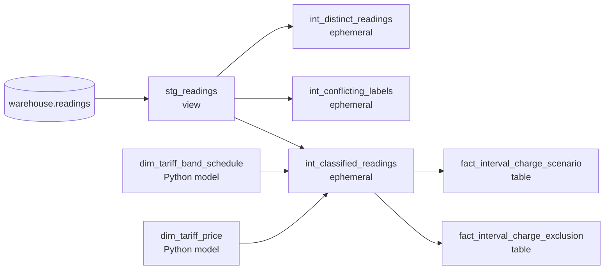

# Energy Reconciliation

[](https://github.com/Hammamelsh/energy-reconciliation/actions/workflows/ci.yml)

Half-hourly electricity meter readings from the Low Carbon London trial (2011–2014), taken from
the raw archive to a tested, versioned tariff calculation — with every figure traceable to the
rows and the assumption it rests on.

**The problem.** Smart-meter data looks simple: a household id, a timestamp, a kWh value. In
practice the timestamps carry no timezone, missing readings are written as the text `Null`, rows
are duplicated, one household's readings are split across files, and the tariff that should be
applied has an unknown effective period. Any total built on top of that — a bill, a forecast, a
comparison — inherits those problems silently unless each one is found, counted and decided.

**What it produces.**

- A **profile** of one source file: every record classified, with counts that reconcile.
- A local **DuckDB warehouse** loaded from the archive, with a rerun policy that never leaves
  half-loaded data behind.
- A **tariff scenario** modelled in **dbt**: the trial's dynamic time-of-use price bands joined to
  each half-hour reading, with an exact-decimal charge and a stated reason for every reading
  that was excluded.
- A **publication workflow**: a warehouse is built as a candidate, sealed only when every dbt
  model and test passed, promoted by an atomic manifest swap, and read back through a validated
  contract. A published result can be **recorded and rebuilt** from the source archive to check
  that the same rows and the same totals come out.
- A **Streamlit dashboard** for one household's data quality, tariff scenario and forecast
  backtest.
- A **forecasting backtest**: simple daily baselines, evaluated honestly on held-out days.

**What it is used for.** Examining the quality of interval data before building on it; tracing
a tariff calculation from each half-hour reading to its band, price, exact charge or exclusion
reason; and reproducing an analytical result from its recorded inputs to confirm the same rows
and totals come out. The same approach applies to any interval data — energy, IoT, telemetry —
where a total is only as trustworthy as the rows and assumptions beneath it.

## What it shows

Three results, each measured on a stated slice of the data. Nothing here is representative of the
trial or of London, and no figure should be scaled up.

### 1. In the 2013 dynamic tariff, the expensive band is 5% of the energy and 24% of the charge

*Sample: the 27 `ToU` households in source file 135 (of 168), 2013 only — 456,096 charged
half-hour readings.*

The trial's **dynamic time-of-use tariff** ("dToU") priced each half hour as `Low` (3.99 p/kWh),
`Normal` (11.76 p/kWh) or `High` (67.20 p/kWh), announced a day ahead. Joining that schedule to
the readings:

| Band | Share of charged kWh | Share of scenario charge |
|---|---:|---:|
| `Low` | 10.48% | 3.06% |
| `Normal` | 84.62% | 72.85% |
| `High` | 4.90% | 24.09% |

The scenario charge over the sample is £11,675.43 (recorded exactly as
`11675.4339216532500000`). This is an **energy charge under a stated assumption**, not a bill: no
standing charge, levy or tax treatment is modelled, and the assumption that a reading's timestamp
label and a schedule label denote the same half hour (`A1`) is stored on every output row rather
than established. The band shares follow from the price ratio (17 : 3 : 1) and the timing of the
bands; they say nothing about whether anyone changed their behaviour. Full measurements and what
each one does not show:
[`docs/anl-002-tariff-scenario.md`](docs/anl-002-tariff-scenario.md#8-three-findings-and-what-each-does-not-show).

### 2. Missing and zero are different things, and the source mixes them in

*Sample: source file 0 of 168, read in full — 1,000,000 records, 30 households, timestamps from
2011-12-06 to 2014-02-28.*

| | |
|---|---:|
| Exact duplicate rows | 688 |
| Same household and timestamp, different value | 0 |
| `Null` tokens | 29 |
| Of those, off the half-hour grid | 29 (all of them) |
| Zero readings | 45,538 |
| Negative or malformed values | 0 |

A zero is a reading; a `Null` is the absence of one, and why it is absent is not known. Treating
the second as the first understates a household's usage without raising any error. The profiler
counts them separately, the warehouse policy fills nothing in, and the dashboard withholds a total
rather than choosing when two rows disagree. Report:
[`data/profiles/lcl-june2015v2-0-profile.json`](data/profiles/lcl-june2015v2-0-profile.json);
investigation: [`docs/source-data-profile.md`](docs/source-data-profile.md).

### 3. A four-week same-weekday mean beats last week's value on held-out days

*Sample: 40 households with at least 168 consecutive clean days, from source files 4, 5 and 135;
each scored on the final 28 days of its run.*

| Baseline | Holdout MAE (kWh/day) |
|---|---:|
| Mean of the 4 preceding same weekdays | **1.901** |
| Same weekday last week | 2.121 |
| The origin day's total repeated (reference) | 2.322 |

Holdout days average about 10.1 kWh. Every prediction uses only data dated on or before its
origin (checked, not assumed), and a model that would need an unusable day declines rather than
guessing. This is a **historical backtest of baselines**, not a live forecast, and the cohort is
a retrospective clean-data cohort rather than an operational sample. Design and limits:
[`docs/fore-001-forecasting-experiment.md`](docs/fore-001-forecasting-experiment.md).

## How it is built

```
archive (zip)  ──profile-member──▶  JSON profile
      │
      └──ingest-member──▶  DuckDB warehouse: readings + load registry
                                   │
                                   └──build-candidate──▶  dbt build on an isolated copy
                                                               │  5 models · 49 tests
                                                          seal │  (only if all passed)
                                                               ▼
                                     publication promote ──▶  versions/v0001.duckdb + manifest
                                                               │
                              ┌────────────────────────────────┼─────────────────────────┐
                              ▼                                ▼                         ▼
                    publication read              Streamlit dashboard          capture / replay
                 (validated read contract)     (Source → Published version)     format-2 baseline
```

**dbt lineage.** The tariff calculation is a small dbt project over DuckDB
(`dbt-core 1.12.4`, `dbt-duckdb 1.11.0`):



- **Staging** exposes the loaded readings as dbt sees them.
- **Policy** models decide which rows count: exact duplicates collapse to one, rows that disagree
  at the same timestamp are conflicts. Their SQL is **generated from `policy.py` and
  `models.py`**, so the dashboard and dbt apply one definition; `render-dbt-macros --check`
  fails if they drift.
- **Dimensions** are dbt Python models that read the publisher's tariff workbook (or the invented
  demo schedule) through the project's own parsers, with `DECIMAL` prices.
- **Facts**: one row per charged reading with its band, price and exact charge; one row per
  excluded reading with exactly one reason (`ineligible_tariff_group`, `outside_schedule_period`,
  `conflicting_label`, `off_grid_observation`, `missing_value`, `unmatched_schedule_label`,
  `unpriced_band`).
- **Tests** (49) check the accounting closes — `distinct = charged + excluded`, no reading in
  both facts, one reason per exclusion, exact charge arithmetic, unique keys.

Publication is separate from building: a candidate is sealed only when its **latest recorded
build attempt succeeded and ran every one of the 54 required nodes**, and the sealed file is
promoted by writing a new manifest atomically. Readers resolve the manifest once and validate the
seal before showing anything.

## Quickstart — synthetic data, one command

Runs on a **committed, invented 12-row archive**. Downloads nothing; needs neither the real
dataset nor the tariff workbook. Prerequisites: [`uv`](https://docs.astral.sh/uv/) and `git`.

```bash
git clone https://github.com/Hammamelsh/energy-reconciliation.git
cd energy-reconciliation
uv sync --frozen
bash tools/synthetic-quickstart.sh
```

The script ingests the archive, builds a candidate with dbt, promotes it inside a disposable
root, reads it back, records a baseline and rebuilds it from the archive in a fresh directory —
and **asserts each expected figure**, so exit `0` means the numbers matched. It writes only under
`data/proof-scratch/quickstart/`. Expected output (candidate and run names vary):

```
=== 4/6 read it back through the validated read contract ===
published v0001 (cand-….duckdb) · dbt run dbtcand-…@… · dbt build (scenario_build)
  build      : complete, 54 required dbt nodes passed
  schedule   : synthetic-demo (demo) · catalogue 2026-09-08.1 · group ToU
  accounting : 12 rows recorded → 11 distinct (1 collapsed by policy) → 2 charged + 9 excluded · reconciles True
  charge     : GBP 0.7959000000000000 (exact, unrounded)
    band Low            1 readings  GBP 0.0399000000000000
    band High           1 readings  GBP 0.7560000000000000
    excluded ineligible_tariff_group           9
  ok  12 recorded rows collapse to 11 distinct
  …
=== 6/6 rebuild it from the archive alone, in a fresh destination, and compare ===
compared 38 field(s); 0 differ
REBUILD REPRODUCED THE PUBLISHED RESULT EXACTLY.

=== quickstart complete: every expected figure matched ===
```

Those figures can be checked by hand from the archive's 12 rows: one exact duplicate collapses;
`DEMO0001` is a `Std` household while the scenario is scoped to `ToU`, so its 9 rows are excluded
with that reason; `DEMO0002` has 1.000 kWh in the `Low` band at 3.99 p/kWh and 1.125 kWh in the
`High` band at 67.20 p/kWh, giving `0.0399 + 0.756 = 0.7959`.

Then open the dashboard on that published version:

```bash
ENERGY_RECONCILIATION_PUBLICATION_ROOT="$PWD/data/proof-scratch/quickstart/published" \
  PYTHONPATH=src uv run streamlit run src/energy_reconciliation/explorer/app.py
```

In the sidebar choose **Source → Published version**. The dashboard shows a household's daily and
half-hourly readings, its data-quality findings with source references, the tariff scenario per
band and per household, and (with real data) the forecast backtest. The demo schedule covers a
single day, so only the two `DEMO0002` readings on 2013-01-01 are charged.

To remove everything the quickstart created:
`chmod -R u+w data/proof-scratch/quickstart && rm -rf data/proof-scratch/quickstart`.

Each step as a separate command, the real-data path, recording and replaying a published result,
and what to keep for a later replay: [`docs/publication-workflow.md`](docs/publication-workflow.md).

## Engineering decisions

The choices most likely to matter to a reader, each with where it is argued and where it is tested.

1. **One definition of every data rule.** The dashboard's Python and the dbt models cannot
   disagree about what a duplicate or a conflict is, because the dbt macro file is generated from
   `policy.py` and `models.py`, and a check refuses drift.
   [Design D2](docs/anl-003-dbt-design.md#1-decisions) ·
   [`tests/test_dbt_macros.py`](tests/test_dbt_macros.py)
2. **Publish only what a complete build certifies.** Every `dbt build` is recorded as an attempt;
   the seal requires the latest attempt to have succeeded, to have run all 54 required nodes, and
   the tables to still digest as that attempt recorded. A build interrupted by a real `SIGKILL`
   is tested to leave nothing sealable.
   [Design D5](docs/anl-003-dbt-design.md#1-decisions) ·
   [`tests/test_candidate.py`](tests/test_candidate.py) ·
   [`tests/test_publication.py`](tests/test_publication.py)
3. **Reproducibility is executed, not asserted.** A baseline records the input members by
   content digest, the calculation identity and every logical output; replay re-ingests and
   rebuilds into a fresh directory and compares. Running it found two real defects in an earlier
   fingerprint that every test had passed.
   [ANL-002 §9.3](docs/anl-002-tariff-scenario.md#93-two-defects-the-replay-found) ·
   [`docs/rec-001-source-expansion.md`](docs/rec-001-source-expansion.md)
4. **Exact decimals end to end.** Charges are `DECIMAL` in dbt and `Decimal` in Python; the
   scenario total is stored unrounded, and an independent Python sum over the same rows gives the
   same digits. [ANL-002 §7.3](docs/anl-002-tariff-scenario.md#73-independent-check--verified)
5. **Missing is not zero, and conflicts are not resolved by guessing.** Absent readings are never
   replaced with zero; a household whose rows disagree has its total withheld and marked.
   [ANL-002 §4](docs/anl-002-tariff-scenario.md#4-which-policies-apply-and-where-a-figure-is-withheld)
6. **A report applies to a dataset by content, not by file name.** The forecast tab shows a
   report only if the selected warehouse's rows digest to what the report was run on; a renamed
   copy is accepted, different data under the same name is refused.
   [`src/energy_reconciliation/forecast/applicability.py`](src/energy_reconciliation/forecast/applicability.py)
7. **Every claim is labelled by its evidence.** Statements in the investigation documents are
   marked VERIFIED, PUBLISHER-DOCUMENTED, INFERRED, CONTRADICTED or UNKNOWN, and the open
   questions are kept in their own list.
   [`docs/rep-001-verified-facts.md`](docs/rep-001-verified-facts.md) ·
   [`docs/rep-001-assumptions-and-open-questions.md`](docs/rep-001-assumptions-and-open-questions.md)

## Status and limitations

**Open incident: `dbt build` occasionally segfaults.** Three of 303 retained dbt invocations on
the development machine crashed with `SIGSEGV` inside the CPython interpreter, all within one
25-minute window; the cause is not established after three bounded investigations. Consequence:
a crash costs a rerun. In each observed case the attempt was recorded as failed and nothing was
sealed, which is the behaviour the seal gate is designed to enforce; the hosted CI run has no
retries, so a crash there fails the run visibly. The workflow is therefore **not suitable for
unattended operation** until the cause is found. Evidence, corrections to earlier wording, and
the next step:
[`docs/tickets/ANL-003-dbt-port.md`](docs/tickets/ANL-003-dbt-port.md#open-release-blocker--dbt-build-segfaults-intermittently-third-investigation-2026-09-09-unresolved).

**Scope of the data.** One source file of 168 has been profiled in full and three have been
loaded. The 27 `ToU` households are the households that happen to occupy one file, not a sample
drawn from the trial. Households continue across file boundaries, so three files are not any
household's complete history.

**Scope of the calculation.** The tariff figures are an energy charge under assumption `A1`.
The flat rate's effective period is not documented by the publisher, so **no `Std` household
has been costed**; a **dynamic-versus-flat comparison is proposed work**, not a result. The
timezone and whether a timestamp marks the start or end of its half hour are unresolved, which
is enough to block any defensible billing period. No causal claim about the tariff is made or
supportable from this data.

**Scope of the forecasting.** Two baselines and a reference, on daily totals, for a cohort chosen
by data cleanliness. No seasonal, weather or learned model has been tried.

**Scope of the tooling.** No orchestration, no cloud deployment, no geographic breakdown.
Ingestion holds a whole file in one transaction, which costs about 1 GB of memory per
million-row file. Verified on Linux only: Ubuntu 24.04 under WSL2 (Python 3.12.14) and
GitHub-hosted `ubuntu-24.04` (Python 3.12.3). The publication design relies on POSIX `rename`
semantics on one filesystem and the recovery path reads `/proc`, so macOS and Windows would need
their own verification.

Planned work, in order, with completion conditions: [`docs/roadmap.md`](docs/roadmap.md).
What is deliberately not claimed: [`docs/portfolio-evidence.md`](docs/portfolio-evidence.md).

## Working with the real dataset

The archive is about 1.5 GB and is not in this repository (`data/raw/` is git-ignored).

1. Download *Partitioned LCL Data.zip* and *Tariffs.xlsx* from the
   [London Datastore](https://data.london.gov.uk/dataset/smartmeter-energy-consumption-data-in-london-households-vqm0d)
   into `data/raw/`. Leave the archive zipped;
   [`data/manifests/raw-file-manifest.csv`](data/manifests/raw-file-manifest.csv) records the
   expected sizes and SHA-256 digests.
2. Profile one file: `uv run profile-member` (defaults to file 0; options in
   [`docs/profiling.md`](docs/profiling.md)).
3. Load files 4, 5 and 135 — two adjacent `Std` files that share household `MAC000166`, and the
   first `ToU` file:

   ```bash
   uv run ingest-member \
     --member "Small LCL Data/LCL-June2015v2_4.csv" \
     --member "Small LCL Data/LCL-June2015v2_5.csv" \
     --member "Small LCL Data/LCL-June2015v2_135.csv"
   ```

4. Build, publish and view exactly as in the quickstart but with `--schedule workbook` and the
   real warehouse as `--source`; run the forecast backtest with
   `uv run run-forecast-experiment`. Steps and outputs:
   [`docs/publication-workflow.md`](docs/publication-workflow.md).

## Tests and CI

```bash
uv run pytest -q
```

563 tests. None needs the real dataset: fixtures build small zip archives in temporary
directories, and the tariff tests check hand-computed figures written in each test's docstring.
Two tests skip, by name, when a local real or demo warehouse is absent. Several tests run real
`dbt build`s against synthetic warehouses, so the suite takes a few minutes.

[`.github/workflows/ci.yml`](.github/workflows/ci.yml) runs `ruff check`, `ruff format --check`,
the policy-macro drift check, the test suite and the synthetic quickstart on `ubuntu-24.04` with
locked dependencies and no retries. It passed on GitHub Actions
([run 34406642130](https://github.com/Hammamelsh/energy-reconciliation/actions/runs/34406642130)
for commit `336bb21`: 561 passed, 2 skipped, quickstart figures matched, replay 38 fields with
0 differing). A green run shows the synthetic path
reproduces on a second machine; it does not exercise the real dataset, which stays a local check.

## Documentation

| | |
|---|---|
| [`docs/publication-workflow.md`](docs/publication-workflow.md) | Build, seal, promote, read, record and replay — step by step |
| [`docs/anl-003-dbt-design.md`](docs/anl-003-dbt-design.md) | The dbt port: decisions D1–D9 and the figures it must reproduce |
| [`docs/anl-002-tariff-scenario.md`](docs/anl-002-tariff-scenario.md) | The tariff scenario: model, measurements, reproduction and limits |
| [`docs/anl-001-tariff-workbook-findings.md`](docs/anl-001-tariff-workbook-findings.md) | What the tariff workbook actually contains |
| [`docs/fore-001-forecasting-experiment.md`](docs/fore-001-forecasting-experiment.md) | The forecasting backtest: design, results and limits |
| [`docs/i-08-prior-data-eligibility.md`](docs/i-08-prior-data-eligibility.md) | Forecast eligibility without hindsight |
| [`docs/rec-001-source-expansion.md`](docs/rec-001-source-expansion.md) | Reproducing a result and explaining what more source changed |
| [`docs/source-data-profile.md`](docs/source-data-profile.md) | The full source investigation, every claim labelled |
| [`docs/rep-001-verified-facts.md`](docs/rep-001-verified-facts.md) · [`…-assumptions-and-open-questions.md`](docs/rep-001-assumptions-and-open-questions.md) | What is established, and what is not |
| [`docs/profiling.md`](docs/profiling.md) | Running the profiler; what the report contains |
| [`docs/roadmap.md`](docs/roadmap.md) | Delivery milestones and their completion conditions |
| [`docs/ideas.md`](docs/ideas.md) | Candidate work recorded but not authorised |
| [`docs/tickets/`](docs/tickets/) | The ticket for each piece of work, written before it began |

## Data source, attribution and licence

> Contains data from *SmartMeter Energy Consumption Data in London Households*, published by UK
> Power Networks via the London Datastore under the Creative Commons Attribution 4.0
> International licence (CC BY 4.0). Accessed 2026-09-06 from
> <https://data.london.gov.uk/dataset/smartmeter-energy-consumption-data-in-london-households-vqm0d>

The tariff workbook (`Tariffs.xlsx`) is one of that dataset's published resources, so the same
attribution covers it (checked on the dataset page, 2026-09-09). The publisher supplies no
required attribution sentence; the wording above is this project's own. Details:
[`docs/source-data-profile.md`](docs/source-data-profile.md) §14.5.

**What is and is not redistributed.** No readings and no workbook are in this repository. One
derived artefact is tracked: the profile report for source file 0, which holds counts,
distributions and per-household spans keyed by the dataset's own pseudonymous household ids, and
no reading values. The only loadable data committed is the invented demo archive.

**Code licence: not yet chosen.** There is no `LICENSE` file and no `license` field in
`pyproject.toml`, so no permission to use, modify or redistribute the code is granted yet; default
copyright applies. Until one is added, treat the code as readable but not reusable.
